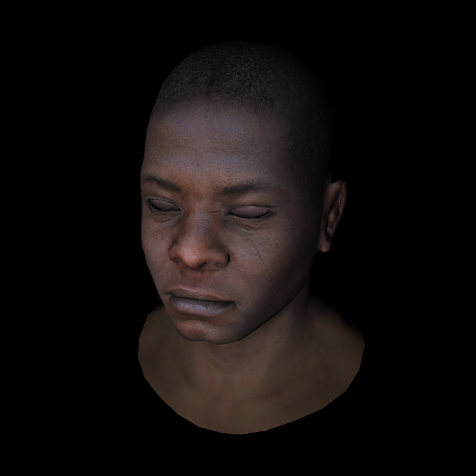

## Playing around with software rendering and Rust

After finding https://github.com/ssloy/tinyrenderer/wiki, I decided to play
around with Rust to see if I could follow along.

It turned out to be pretty fun! I scraped together a 640 line software
renderer, but I also had to write my own matrix, vector, and (some of an) image
libraries (if anyone knows of good vector/matrix libraries let me know!)

Sample of the output: 

(To build, you need
[this file named head.obj](https://github.com/ssloy/tinyrenderer/blob/master/obj/african_head/african_head.obj)
and
[this file named head_tex.tga](https://github.com/ssloy/tinyrenderer/blob/master/obj/african_head/african_head_diffuse.tga),
and run `make`)
